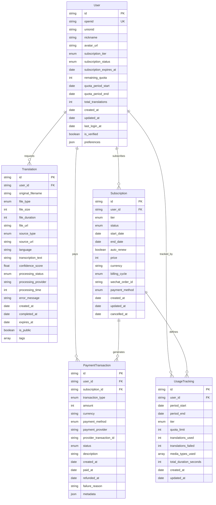

# Data Model: WeChat Media Translator

**Date**: 2025-10-18  
**Feature**: WeChat Media Translator Mini-Program

## Core Entities

### 1. User (用户)

**Purpose**: User account management and authentication

**Fields**:
```typescript
interface User {
  id: string;                    // Unique user identifier (UUID)
  openid: string;               // WeChat OpenID (primary authentication)
  unionid?: string;             // WeChat UnionID (cross-app identification)
  nickname?: string;            // WeChat nickname
  avatar_url?: string;          // WeChat profile avatar
  phone_number?: string;        // Phone number (with consent)
  subscription_tier: SubscriptionTier;  // Current subscription level
  subscription_status: SubscriptionStatus; // Active/expired/cancelled
  subscription_expires_at?: Date; // Subscription expiration date
  remaining_quota: number;      // Remaining translations in current period
  quota_period_start: Date;     // Current quota period start
  quota_period_end: Date;       // Current quota period end
  total_translations: number;   // Lifetime translation count
  created_at: Date;            // Account creation timestamp
  updated_at: Date;            // Last update timestamp
  last_login_at?: Date;        // Last login time
  is_verified: boolean;        // Phone/identity verification status
  preferences: UserPreferences; // User preferences and settings
}
```

**Validation Rules**:
- `openid` is required and unique
- `subscription_tier` defaults to 'free'
- `remaining_quota` cannot be negative
- `subscription_expires_at` must be future date for active subscriptions

**State Transitions**:
```
Unverified → Verified (phone verification)
Free → Basic/Premium/Enterprise (upgrade)
Basic → Premium/Enterprise (upgrade)
Premium → Enterprise (upgrade)
Any tier → Lower tier (downgrade at period end)
Active → Expired (grace period 7 days)
Expired → Active (renewal)
```

### 2. Subscription (订阅)

**Purpose**: Subscription tier management and billing

**Fields**:
```typescript
interface Subscription {
  id: string;                   // Subscription ID (UUID)
  user_id: string;             // Associated user ID
  tier: SubscriptionTier;      // Subscription tier
  status: SubscriptionStatus;   // Current status
  start_date: Date;            // Subscription start date
  end_date: Date;              // Subscription end date
  auto_renew: boolean;         // Auto-renewal enabled
  price: number;               // Subscription price (in Yuan/Fen)
  currency: string;            // Currency code (CNY)
  billing_cycle: BillingCycle; // Monthly/Yearly
  wechat_order_id?: string;    // WeChat Pay order ID
  payment_method: PaymentMethod; // WeChat Pay / Alipay
  created_at: Date;            // Subscription creation
  updated_at: Date;            // Last update
  cancelled_at?: Date;         // Cancellation timestamp
}
```

**Subscription Tiers**:
```typescript
enum SubscriptionTier {
  FREE = 'free',              // 1 translation per period
  BASIC = 'basic',            // 10 translations/month @ ¥9.9
  PREMIUM = 'premium',        // 50 translations/month @ ¥29.9
  ENTERPRISE = 'enterprise'   // Unlimited translations @ ¥99.9
}

enum SubscriptionStatus {
  ACTIVE = 'active',
  EXPIRED = 'expired',
  CANCELLED = 'cancelled',
  PENDING = 'pending'         // Payment processing
}

enum BillingCycle {
  MONTHLY = 'monthly',
  YEARLY = 'yearly'
}
```

### 3. Translation (翻译)

**Purpose**: Media-to-text translation records and results

**Fields**:
```typescript
interface Translation {
  id: string;                  // Translation ID (UUID)
  user_id: string;            // User who requested translation
  original_filename: string;   // Original media filename
  file_type: MediaType;       // Audio/Video/File type
  file_size: number;          // File size in bytes
  file_duration?: number;     // Media duration in seconds
  file_url?: string;          // Stored file URL (WeChat Cloud Storage)
  source_type: SourceType;    // Upload/recording/URL source
  source_url?: string;        // Original URL if applicable
  language: string;           // Detected/target language (zh-CN, en-US)
  transcription_text?: string; // Transcribed text result
  confidence_score?: number;  // Transcription confidence (0-1)
  processing_status: ProcessingStatus; // Queued/Processing/Completed/Failed
  processing_provider: string; // Alibaba/Tencent/Azure
  processing_time?: number;   // Processing time in milliseconds
  error_message?: string;     // Error details if failed
  created_at: Date;          // Translation request timestamp
  completed_at?: Date;       // Completion timestamp
  expires_at?: Date;         // Result expiration (30 days)
  is_public: boolean;        // Public result visibility
  tags?: string[];           // User-defined tags
}
```

**Media Types**:
```typescript
enum MediaType {
  VOICE_RECORDING = 'voice_recording',    // WeChat voice message
  AUDIO_FILE = 'audio_file',             // Uploaded audio file
  VIDEO_FILE = 'video_file',             // Uploaded video file
  WECHAT_VIDEO = 'wechat_video',         // WeChat video message
  URL_MEDIA = 'url_media'                // Media from URL
}

enum SourceType {
  DIRECT_UPLOAD = 'direct_upload',
  WECHAT_MESSAGE = 'wechat_message',
  URL_IMPORT = 'url_import'
}

enum ProcessingStatus {
  QUEUED = 'queued',
  PROCESSING = 'processing', 
  COMPLETED = 'completed',
  FAILED = 'failed',
  EXPIRED = 'expired'
}
```

### 4. PaymentTransaction (支付交易)

**Purpose**: Payment transaction records and reconciliation

**Fields**:
```typescript
interface PaymentTransaction {
  id: string;                  // Transaction ID (UUID)
  user_id: string;            // User who made payment
  subscription_id?: string;   // Associated subscription
  transaction_type: TransactionType; // Subscription/Purchase/Refund
  amount: number;             // Payment amount in Fen
  currency: string;           // Currency code (CNY)
  payment_method: PaymentMethod; // WeChat Pay/Alipay
  payment_provider: string;   // WeChat Pay/Tencent/Alipay
  provider_transaction_id: string; // External transaction ID
  status: PaymentStatus;      // Pending/Success/Failed/Refunded
  description: string;        // Transaction description
  created_at: Date;          // Transaction creation
  paid_at?: Date;            // Payment completion time
  refunded_at?: Date;        // Refund processing time
  failure_reason?: string;   // Failure reason if applicable
  metadata: Record<string, any>; // Additional provider data
}
```

### 5. UsageTracking (使用统计)

**Purpose**: User usage analytics and quota management

**Fields**:
```typescript
interface UsageTracking {
  id: string;                  // Tracking ID (UUID)
  user_id: string;            // User identifier
  period_start: Date;         // Usage period start
  period_end: Date;           // Usage period end
  tier: SubscriptionTier;     // Tier during this period
  quota_limit: number;        // Total allowed translations
  translations_used: number;  // Translations completed
  translations_failed: number; // Failed translation attempts
  media_types_used: MediaType[]; // Types of media processed
  total_duration_seconds: number; // Total media duration processed
  created_at: Date;          // Record creation
  updated_at: Date;          // Last update
}
```

## Entity Relationships



## Database Indexes

### Primary Indexes
- `User.id` (Primary Key)
- `User.openid` (Unique Index)
- `Translation.id` (Primary Key)
- `Subscription.id` (Primary Key)
- `PaymentTransaction.id` (Primary Key)
- `UsageTracking.id` (Primary Key)

### Secondary Indexes (Performance)
- `Translation.user_id` (User translation history)
- `Translation.created_at` (Chronological queries)
- `Translation.processing_status` (Processing queue)
- `Subscription.user_id` (User subscription lookup)
- `Subscription.status` (Active subscriptions)
- `PaymentTransaction.user_id` (User payment history)
- `PaymentTransaction.status` (Payment processing)
- `UsageTracking.user_id` (User analytics)
- `UsageTracking.period_start` (Period-based queries)

## Data Validation Rules

### User Data
- `openid` must be valid WeChat OpenID format
- `remaining_quota` must be >= 0
- `subscription_expires_at` cannot be past for active subscriptions

### Translation Data
- `file_size` must be > 0 and <= upload limits (10MB audio, 100MB video)
- `file_duration` must be > 0 and <= processing limits (30min audio, 10min video)
- `confidence_score` must be between 0 and 1 if present

### Subscription Data
- `price` must be positive and match tier pricing
- `end_date` must be after `start_date`
- `auto_renew` defaults to true unless explicitly cancelled

### Payment Data
- `amount` must be positive integer (in Fen)
- `currency` must be 'CNY' for Chinese market
- `provider_transaction_id` must be unique per payment provider

## Data Retention Policies

### User Data
- Personal data: Retain until account deletion
- Usage analytics: Retain for 2 years for business intelligence
- Translation history: Retain for 30 days (free users) or 1 year (VIP users)

### Translation Data
- Media files: Delete after 30 days or user deletion
- Transcription results: Delete after 30 days (free) or 1 year (VIP)
- Processing logs: Retain for 90 days for troubleshooting

### Financial Data
- Payment records: Retain for 7 years (legal requirement)
- Subscription history: Retain for 7 years
- Refund records: Retain for 7 years

## Security Considerations

### Data Encryption
- Personal data encrypted at rest
- Payment data encrypted with industry standards
- API communications secured with TLS

### Access Control
- User data access limited to owning user
- Admin access requires proper authentication
- API rate limiting prevents abuse

### Privacy Compliance
- Explicit consent required for data processing
- Right to data deletion respected
- Data residency requirements for Chinese users

This data model provides a comprehensive foundation for the WeChat Media Translator mini-program, ensuring proper data relationships, validation, and compliance with Chinese regulations while supporting the freemium business model and multi-format media processing requirements.