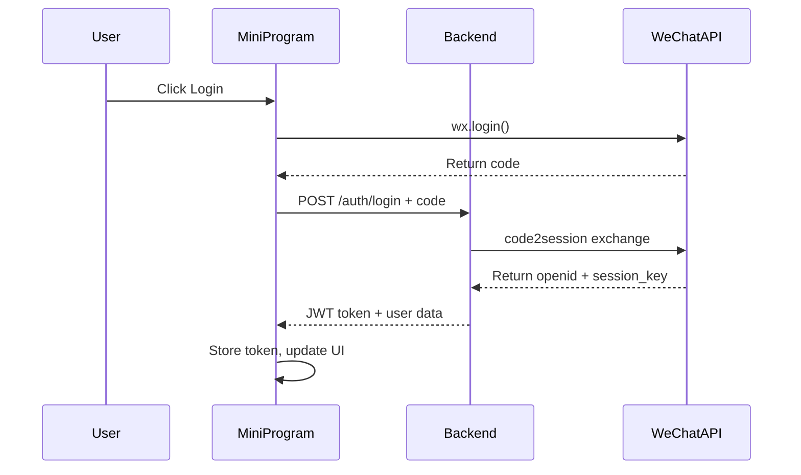
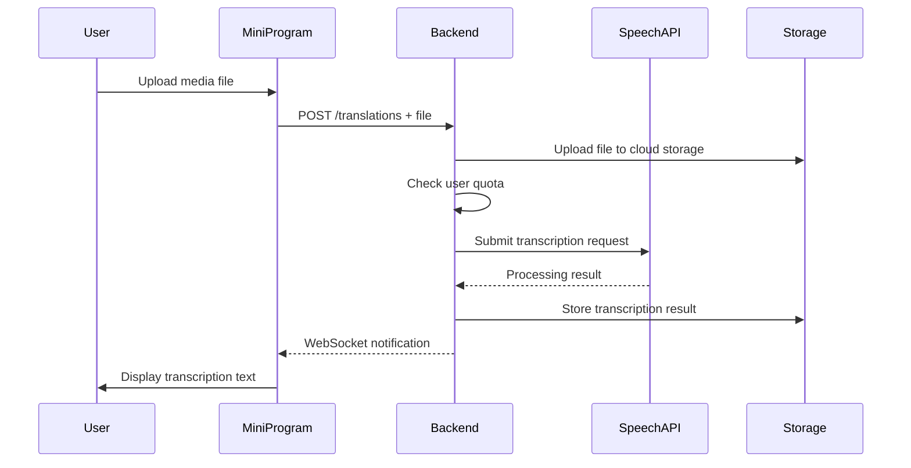
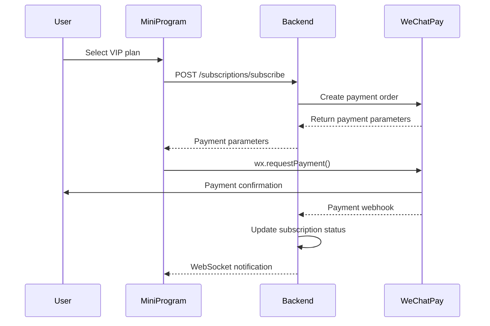

# Quickstart Guide: WeChat Media Translator

**Date**: 2025-10-18  
**Version**: 1.0.0  
**Feature**: WeChat Media Translator Mini-Program

## Overview

This guide helps you quickly set up and understand the WeChat Media Translator mini-program architecture. The system consists of a WeChat mini-program frontend and FastAPI backend with media processing capabilities.

## System Architecture

```
┌─────────────────┐    ┌─────────────────┐    ┌─────────────────┐
│   WeChat Mini   │    │   FastAPI       │    │   External      │
│   Program       │◄──►│   Backend API   │◄──►|   Services      │
│                 │    │                 │    │                 │
│ • Media Upload  │    │ • Auth/User Mgmt│    │ • Speech API    │
│ • Results UI    │    │ • Quota Mgmt    │    │ • Payment API   │
│ • VIP Features  │    │ • File Processing│   │ • Storage       │
└─────────────────┘    └─────────────────┘    └─────────────────┘
        │                       │                       │
        └───────────────────────┼───────────────────────┘
                                │
                    ┌─────────────────┐
                    │   WeChat Cloud  │
                    │   Services      │
                    │                 │
                    │ • Database      │
                    │ • Storage       │
                    │ • Functions     │
                    └─────────────────┘
```

## Technology Stack

### Frontend (WeChat Mini-Program)
- **Language**: TypeScript 4.9+
- **Framework**: WeChat Mini-Program Native
- **UI Components**: WeChat Official Components
- **Testing**: WeChat DevTools

### Backend (Node.js)
- **Runtime**: Node.js 16+
- **Framework**: Express.js
- **Language**: TypeScript
- **Database**: WeChat Cloud Database + Redis
- **File Storage**: WeChat Cloud Storage
- **Testing**: Jest

### External Services
- **Speech Recognition**: Alibaba Cloud + Tencent Cloud
- **Payment**: WeChat Pay + Alipay
- **Media Processing**: FFmpeg
- **Authentication**: JWT + WeChat OAuth

## Local Development Setup

### Prerequisites
- Node.js 16+ installed
- WeChat DevTools installed
- WeChat Developer Account
- Git for version control

### 1. Clone Repository
```bash
git clone https://github.com/your-org/wechat-media-translator.git
cd wechat-media-translator
```

### 2. Backend Setup
```bash
# Navigate to backend directory
cd backend

# Install dependencies
npm install

# Copy environment template
cp .env.example .env

# Configure environment variables
# Edit .env with your API keys and configurations
```

**Environment Variables (.env)**:
```env
# WeChat Mini-Program
WECHAT_APP_ID=your_wechat_app_id
WECHAT_APP_SECRET=your_wechat_app_secret

# Speech Recognition APIs
ALIBABA_CLOUD_ACCESS_KEY=your_alibaba_key
ALIBABA_CLOUD_SECRET=your_alibaba_secret
TENCENT_CLOUD_SECRET_ID=your_tencent_id
TENCENT_CLOUD_SECRET_KEY=your_tencent_key

# Payment
WECHAT_PAY_MCH_ID=your_mch_id
WECHAT_PAY_API_KEY=your_api_key

# Database
WECHAT_CLOUD_ENV=your_cloud_env
REDIS_URL=redis://localhost:6379

# JWT
JWT_SECRET=your_jwt_secret
JWT_EXPIRES_IN=24h
```

### 3. Frontend Setup
```bash
# Navigate to mini-program directory
cd ../wechat-miniprogram

# Install dependencies
npm install

# Copy configuration template
cp project.config.example.js project.config.js

# Configure WeChat App ID in project.config.js
```

**project.config.js**:
```javascript
module.exports = {
  appid: 'your_wechat_app_id',
  projectname: 'wechat-media-translator',
  setting: {
    urlCheck: false,
    es6: true,
    postcss: true,
    minified: true
  }
}
```

### 4. Start Development Servers

**Backend Server**:
```bash
cd backend
npm run dev
# Server runs on http://localhost:3000
```

**Frontend Development**:
1. Open WeChat DevTools
2. Import project from `wechat-miniprogram` directory
3. Enable "Do not verify legal domain" for local testing
4. Preview in simulator or scan QR code for device testing

## Core Functionality

### User Authentication Flow


### Translation Processing Flow


### Payment Flow


## API Integration Examples

### Frontend API Client
```typescript
// utils/api.ts
const BASE_URL = 'https://api.wechat-translator.com/v1'

class APIClient {
  private token: string | null = null

  setToken(token: string) {
    this.token = token
  }

  private async request(endpoint: string, options: RequestInit = {}) {
    const url = `${BASE_URL}${endpoint}`
    const headers = {
      'Content-Type': 'application/json',
      ...(this.token && { Authorization: `Bearer ${this.token}` }),
      ...options.headers,
    }

    return fetch(url, { ...options, headers })
  }

  // User authentication
  async login(code: string) {
    const response = await this.request('/auth/login', {
      method: 'POST',
      body: JSON.stringify({ code }),
    })
    const data = await response.json()
    this.setToken(data.data.token)
    return data
  }

  // Get user quota
  async getQuota() {
    return this.request('/user/quota')
  }

  // Upload and translate media
  async translateFile(file: File, fileType: string) {
    const formData = new FormData()
    formData.append('file', file)
    formData.append('file_type', fileType)

    return this.request('/translations', {
      method: 'POST',
      body: formData,
      headers: {}, // Let browser set Content-Type for FormData
    })
  }

  // Get translation history
  async getTranslations(page = 1, limit = 20) {
    return this.request(`/translations?page=${page}&limit=${limit}`)
  }
}

export const api = new APIClient()
```

### Backend Key Services
```typescript
// services/translation.service.ts
export class TranslationService {
  async createTranslation(userId: string, file: Express.Multer.File, options: TranslationOptions) {
    // 1. Check user quota
    const user = await this.userService.findById(userId)
    if (user.remaining_quota <= 0) {
      throw new QuotaExceededException()
    }

    // 2. Upload file to cloud storage
    const fileUrl = await this.storageService.uploadFile(file)

    // 3. Create translation record
    const translation = await this.translationRepository.create({
      user_id: userId,
      original_filename: file.originalname,
      file_type: options.fileType,
      file_size: file.size,
      file_url,
      processing_status: ProcessingStatus.QUEUED,
    })

    // 4. Queue for processing
    await this.queueService.add('process-translation', {
      translationId: translation.id,
      fileUrl,
      language: options.language || 'zh-CN',
    })

    // 5. Decrement quota
    await this.userService.updateQuota(userId, -1)

    return translation
  }

  async processTranslation(translationId: string) {
    const translation = await this.translationRepository.findById(translationId)
    
    try {
      // Update status to processing
      await translation.update({ processing_status: ProcessingStatus.PROCESSING })

      // Transcribe using speech API
      const result = await this.speechService.transcribe(translation.file_url)

      // Update with results
      await translation.update({
        transcription_text: result.text,
        confidence_score: result.confidence,
        processing_status: ProcessingStatus.COMPLETED,
        completed_at: new Date(),
        processing_time: result.processingTime,
      })

      // Notify user via WebSocket
      await this.notificationService.notifyUser(translation.user_id, {
        type: 'translation_completed',
        translationId: translation.id,
      })

    } catch (error) {
      await translation.update({
        processing_status: ProcessingStatus.FAILED,
        error_message: error.message,
      })
    }
  }
}
```

## Testing

### Backend Tests
```bash
cd backend

# Run unit tests
npm test

# Run integration tests
npm run test:integration

# Run with coverage
npm run test:coverage
```

### Frontend Tests
```bash
cd wechat-miniprogram

# Run unit tests
npm test

# WeChat DevTools integration testing
# Use WeChat DevTools debugging panel
```

### Test Data Examples
```typescript
// Mock user data
const mockUser = {
  id: 'test-user-id',
  openid: 'test-openid',
  subscription_tier: 'basic',
  remaining_quota: 8,
}

// Mock translation data
const mockTranslation = {
  id: 'test-translation-id',
  user_id: 'test-user-id',
  original_filename: 'test-audio.mp3',
  file_type: 'voice_recording',
  transcription_text: '测试转录文本',
  confidence_score: 0.95,
  processing_status: 'completed',
}
```

## Deployment

### Production Deployment Steps

1. **Backend Deployment**:
   ```bash
   # Build for production
   npm run build
   
   # Deploy to cloud server
   npm run deploy:prod
   ```

2. **Mini-Program Submission**:
   - Upload code in WeChat DevTools
   - Submit for review
   - Wait for approval (1-7 business days)

3. **Database Migration**:
   ```bash
   # Run database migrations
   npm run migrate:prod
   ```

### Environment Configuration
- **Production**: Use production API keys and WeChat Cloud
- **Staging**: Use staging environment for testing
- **Development**: Local environment with mock data

## Monitoring and Debugging

### Key Metrics to Monitor
- API response times
- Translation success rates
- User quota utilization
- Payment conversion rates
- Error rates and types

### Debugging Tools
- WeChat DevTools Console
- Backend application logs
- Database query logs
- External service monitoring dashboards

### Common Issues and Solutions

1. **File Upload Failures**:
   - Check file size limits
   - Verify network connectivity
   - Ensure proper file format

2. **Speech Recognition Errors**:
   - Verify API key configuration
   - Check audio format compatibility
   - Monitor API quota limits

3. **Payment Processing Issues**:
   - Verify WeChat Pay configuration
   - Check webhook URL accessibility
   - Ensure proper signature verification

## Support Resources

### Documentation
- [WeChat Mini-Program Official Docs](https://developers.weixin.qq.com/miniprogram/dev/framework/)
- [Alibaba Cloud Speech API](https://help.aliyun.com/product/30413.html)
- [WeChat Pay API](https://pay.weixin.qq.com/wiki/doc/apiv3/index.shtml)

### Community
- WeChat Developer Community
- Node.js and TypeScript communities
- Stack Overflow for technical issues

### Getting Help
- Internal development team chat
- Code repository issues and discussions
- Regular team standups and retrospectives

This quickstart guide provides the essential information to understand and begin developing the WeChat Media Translator mini-program. For detailed implementation guidance, refer to the specific documentation in each component directory.